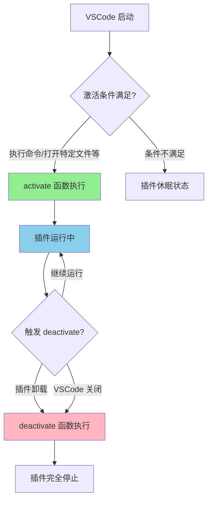
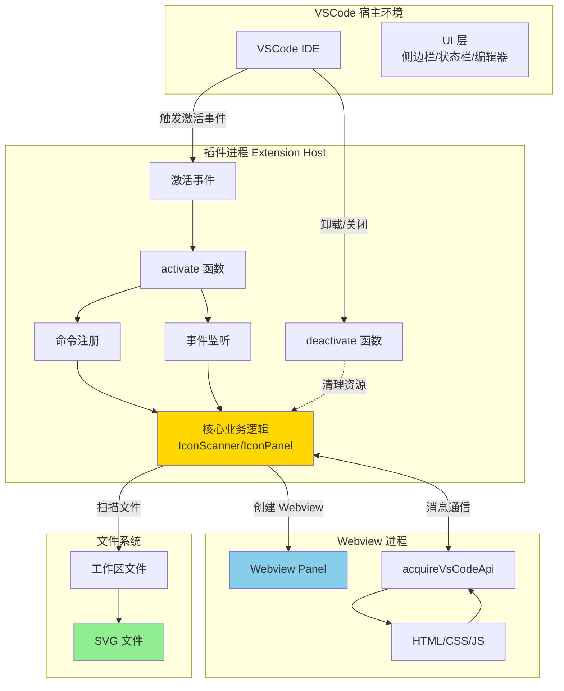
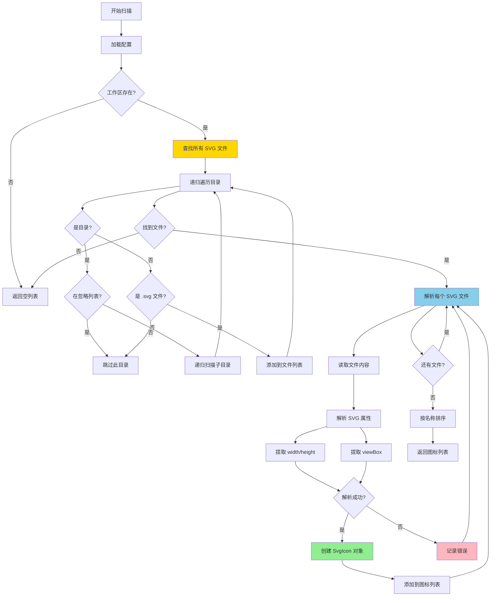
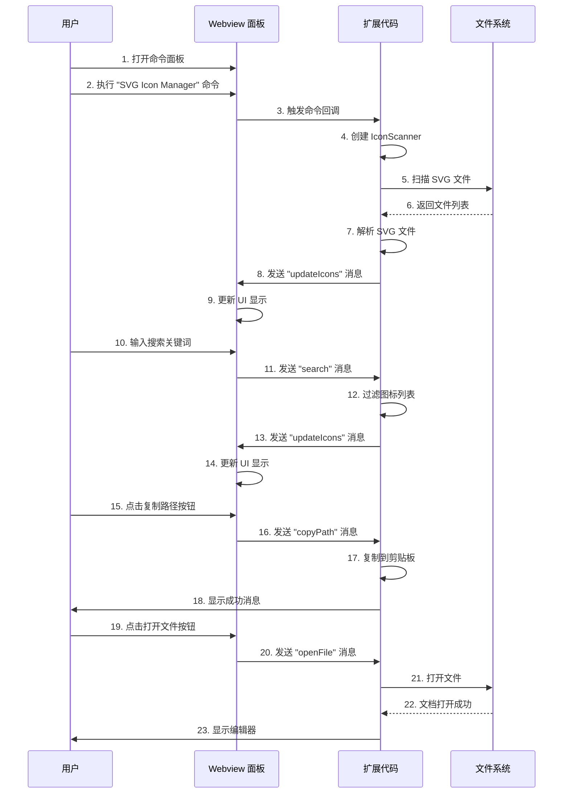
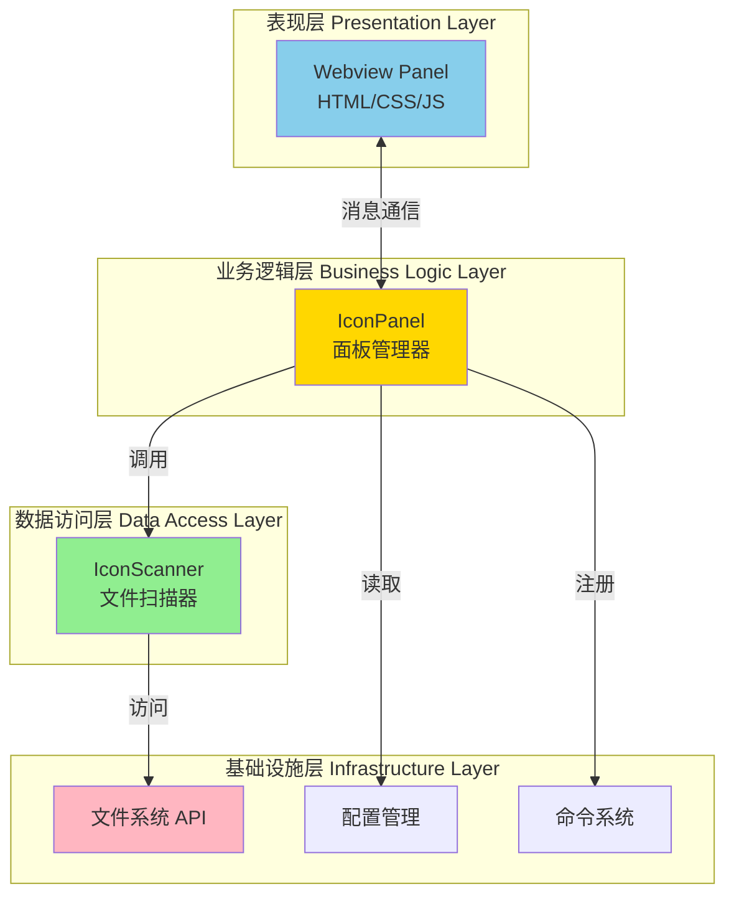
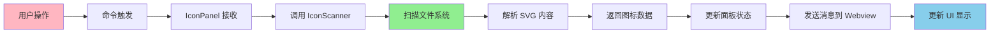
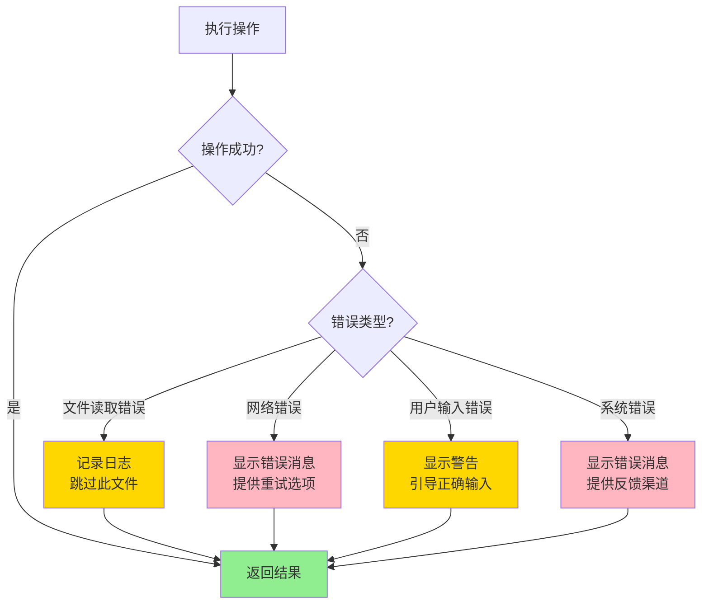
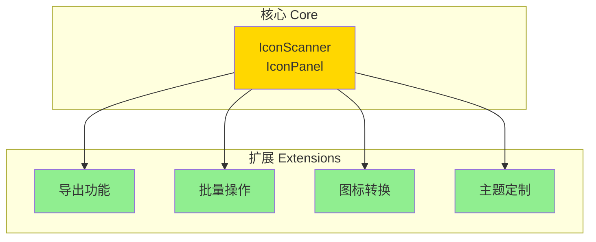
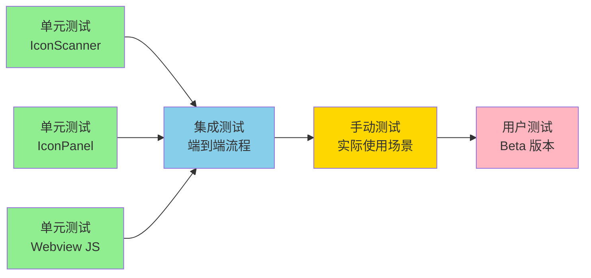

# VSCode 插件开发教程 - 从零开始构建 SVG Icon Manager

本教程将带你从零开始学习 VSCode 插件开发，通过一个实际的 SVG 图标管理项目，让你掌握插件开发的核心概念和实践技巧。

## 目录

1. [前置知识准备](#前置知识准备)
2. [VSCode 插件基础概念](#vscode-插件基础概念)
3. [项目结构解析](#项目结构解析)
4. [核心功能实现详解](#核心功能实现详解)
5. [Webview 交互实现](#webview-交互实现)
6. [调试与测试](#调试与测试)
7. [打包与发布](#打包与发布)
8. [最佳实践与进阶技巧](#最佳实践与进阶技巧)

---

## 前置知识准备

### 需要掌握的技术

- **JavaScript/TypeScript**: 插件开发主要使用 TypeScript，具备基本的面向对象编程知识
- **Node.js**: 熟悉文件系统操作、异步编程
- **HTML/CSS**: 用于 Webview 界面开发
- **VSCode 基本使用**: 了解 VSCode 的命令面板、扩展面板等基本功能

### 开发环境配置

1. **安装 Node.js**
   ```bash
   node --version  # 建议 v18 或更高版本
   ```

2. **安装 VSCode**
   - 下载并安装最新版本的 VSCode

3. **安装必要的 VSCode 扩展**
   - TypeScript 和 JavaScript Language Features (内置)
   - ESLint (可选，用于代码规范)

---

## VSCode 插件基础概念

### 什么是 VSCode 插件？

VSCode 插件（Extension）是一种扩展 VSCode 功能的方式，可以：
- 添加新的命令和快捷键
- 提供 UI 元素（如侧边栏、状态栏、Webview 面板）
- 与编辑器深度集成
- 处理文件系统和工作区操作
- 创建自定义语言支持

### 插件的生命周期

插件的生命周期遵循以下流程：



- **activate**: 当满足激活条件时执行（如执行命令、打开特定文件）
- **deactivate**: 插件卸载或 VSCode 关闭时执行

#### 激活条件类型

常见的激活事件：
- `onCommand:extensionId.commandName` - 执行特定命令时激活
- `onLanguage:javascript` - 打开特定语言文件时激活
- `onStartupFinished` - VSCode 启动完成后激活
- `*` - 激活任何功能时激活（谨慎使用，会影响启动性能）

### 核心概念

#### 1. 整体架构

VSCode 插件的架构如下图所示：



#### 2. Extension API

VSCode 提供的 API 集合，通过 `vscode` 模块访问：

```typescript
import * as vscode from 'vscode';
```

##### 常用 API 模块详解

**vscode.commands - 命令系统**

```typescript
// 注册命令
vscode.commands.registerCommand('extension.commandName', () => {
    // 命令执行逻辑
});

// 执行命令
vscode.commands.executeCommand('workbench.action.files.save');

// 获取所有命令
vscode.commands.getCommands();
```

**vscode.window - 用户界面交互**

```typescript
// 显示信息消息
vscode.window.showInformationMessage('操作成功！');

// 显示警告消息
vscode.window.showWarningMessage('请注意此操作');

// 显示错误消息
vscode.window.showErrorMessage('操作失败！');

// 显示输入框
const input = await vscode.window.showInputBox({
    placeHolder: '请输入...',
    prompt: '提示信息'
});

// 显示选择框
const selection = await vscode.window.showQuickPick([
    { label: '选项1', description: '描述1' },
    { label: '选项2', description: '描述2' }
]);

// 创建 Webview 面板
const panel = vscode.window.createWebviewPanel(
    'webviewId',           // 唯一标识
    '面板标题',            // 标题
    vscode.ViewColumn.One, // 显示位置
    { enableScripts: true } // 配置选项
);

// 显示进度通知
await vscode.window.withProgress({
    location: vscode.ProgressLocation.Notification,
    title: '正在处理...'
}, async (progress) => {
    // 处理逻辑
});

// 显示文本文档
const doc = await vscode.window.showTextDocument(uri);
```

**vscode.workspace - 工作区和文件操作**

```typescript
// 获取工作区根路径
const rootPath = vscode.workspace.rootPath;

// 获取工作区文件夹
const folders = vscode.workspace.workspaceFolders;

// 获取配置
const config = vscode.workspace.getConfiguration('extensionName');
const value = config.get('settingName', 'defaultValue');

// 监听配置变化
vscode.workspace.onDidChangeConfiguration(e => {
    if (e.affectsConfiguration('extensionName')) {
        // 配置变化处理
    }
});

// 监听文件变化
vscode.workspace.onDidChangeFiles(e => {
    e.changes.forEach(change => {
        console.log('文件变化:', change.uri.fsPath);
    });
});

// 创建文件
const uri = vscode.Uri.file('/path/to/file.txt');
await vscode.workspace.fs.writeFile(uri, Buffer.from('内容'));

// 读取文件
const content = await vscode.workspace.fs.readFile(uri);

// 查找文件
const files = await vscode.workspace.findFiles('**/*.ts', '**/node_modules/**');
```

**vscode.env - 环境信息**

```typescript
// 获取剪贴板
await vscode.env.clipboard.writeText('要复制的文本');
const text = await vscode.env.clipboard.readText();

// 获取应用名称
const appName = vscode.env.appName;

// 获取语言
const language = vscode.env.language;

// 获取扩展路径
const extensionPath = vscode.env.appRoot;

// 打开外部链接
await vscode.env.openExternal(vscode.Uri.parse('https://example.com'));
```

**vscode.Uri - 统一资源标识符**

```typescript
// 创建文件 URI
const fileUri = vscode.Uri.file('/path/to/file.txt');

// 解析 URI
const uri = vscode.Uri.parse('file:///path/to/file.txt');

// URI 转换
const fsPath = uri.fsPath;     // 转换为文件系统路径
const toString = uri.toString(); // 转换为字符串
```

**vscode.Range - 文本范围**

```typescript
// 创建范围
const range = new vscode.Range(
    new vscode.Position(0, 0),  // 起始行、列
    new vscode.Position(10, 20) // 结束行、列
);

// 文本编辑器范围操作
const editor = vscode.window.activeTextEditor;
const selection = editor.selection;
const selectedText = editor.document.getText(selection);
```

**vscode.Diagnostic - 诊断信息**

```typescript
// 创建诊断集合
const diagnostics = vscode.languages.createDiagnosticCollection('myExtension');

// 添加诊断
const diagnostic = new vscode.Diagnostic(
    range,
    '错误信息',
    vscode.DiagnosticSeverity.Error
);

diagnostics.set(uri, [diagnostic]);
```

**vscode.StatusBar - 状态栏**

```typescript
// 创建状态栏项
const statusBarItem = vscode.window.createStatusBarItem(
    vscode.StatusBarAlignment.Right,
    100
);

statusBarItem.text = '$(beaker) My Extension';
statusBarItem.command = 'extension.commandName';
statusBarItem.show();
```

**vscode.TreeView - 树形视图**

```typescript
// 创建树形数据提供者
class TreeDataProvider implements vscode.TreeDataProvider<TreeItem> {
    getTreeItem(element: TreeItem): vscode.TreeItem {
        return element;
    }

    getChildren(element?: TreeItem): Thenable<TreeItem[]> {
        // 返回子节点
    }
}

// 创建树形视图
const treeView = vscode.window.createTreeView('extension.treeView', {
    treeDataProvider: new TreeDataProvider()
});
```

#### 2. package.json 配置

插件的清单文件，定义插件的基本信息和能力：

```json
{
  "name": "svg-icon-manager",
  "displayName": "SVG Icon Manager",
  "version": "1.0.0",
  "engines": {
    "vscode": "^1.74.0"
  },
  "activationEvents": ["onCommand:svgIconManager.show"],
  "main": "./out/extension.js",
  "contributes": {
    "commands": [...],
    "keybindings": [...],
    "configuration": {...}
  }
}
```

#### 3. Contribution Points

定义插件如何贡献功能到 VSCode：

- **commands**: 注册命令
- **keybindings**: 定义快捷键
- **configuration**: 提供配置项
- **views**: 添加侧边栏视图
- **languages**: 支持新语言

---

## 项目结构解析

### 完整目录结构

```
svg-icon-manager/
├── .github/
│   └── workflows/          # CI/CD 配置
├── .vscode/
│   ├── launch.json         # 调试配置
│   └── tasks.json          # 任务配置
├── resources/
│   └── icon.svg            # 插件图标
├── src/
│   └── extension.ts        # 主入口文件
├── out/                    # 编译输出目录
├── package.json            # 插件配置文件
├── tsconfig.json           # TypeScript 配置
├── .gitignore
└── README.md
```

### 关键文件说明

#### 1. package.json - 插件配置文件

```json
{
  "name": "svg-icon-manager",              // 插件唯一标识
  "displayName": "SVG Icon Manager",       // 显示名称
  "description": "...",                    // 插件描述
  "version": "1.0.0",                      // 版本号
  "publisher": "miffy-w",                  // 发布者
  "engines": {
    "vscode": "^1.74.0"                    // 最低 VSCode 版本
  },
  "categories": ["Other", "Visualization"], // 分类
  "activationEvents": ["onCommand:svgIconManager.show"], // 激活事件
  "main": "./out/extension.js",            // 入口文件
  "contributes": {                         // 贡献点
    "commands": [
      {
        "command": "svgIconManager.show",
        "title": "Show SVG Icon Manager",
        "category": "SVG Icon Manager"
      }
    ],
    "keybindings": [
      {
        "command": "svgIconManager.show",
        "key": "ctrl+shift+i",
        "mac": "cmd+shift+i"
      }
    ],
    "configuration": {
      "title": "SVG Icon Manager",
      "properties": {
        "svgIconManager.ignorePatterns": {
          "type": "array",
          "default": ["node_modules", ".git", "out", "dist", "build", "coverage"],
          "description": "Directory patterns to ignore when scanning for SVG files"
        },
        "svgIconManager.iconSize": {
          "type": "number",
          "default": 80,
          "minimum": 48,
          "maximum": 128,
          "description": "Size of icon preview in pixels"
        }
      }
    }
  },
  "scripts": {
    "vscode:prepublish": "npm run compile",
    "compile": "tsc -p ./",
    "watch": "tsc -watch -p ./",
    "package": "vsce package",
    "publish": "vsce publish"
  }
}
```

#### 2. tsconfig.json - TypeScript 配置

```json
{
  "compilerOptions": {
    "module": "commonjs",
    "target": "ES2020",
    "outDir": "out",
    "lib": ["ES2020"],
    "sourceMap": true,
    "rootDir": "src",
    "strict": true
  },
  "exclude": ["node_modules", ".vscode-test"]
}
```

#### 3. .vscode/launch.json - 调试配置

```json
{
  "version": "0.2.0",
  "configurations": [
    {
      "name": "Run Extension",
      "type": "extensionHost",
      "request": "launch",
      "args": [
        "--extensionDevelopmentPath=${workspaceFolder}"
      ]
    }
  ]
}
```

---

## 核心功能实现详解

### 1. 插件入口 - extension.ts

插件的主入口文件，定义了插件的激活和停用逻辑。

#### activate 函数 - 插件激活

```typescript
export function activate(context: vscode.ExtensionContext) {
    console.log('SVG Icon Manager is now active!');
    
    // 获取工作区根路径
    const workspaceRoot = vscode.workspace.rootPath;
    
    // 创建图标扫描器
    const scanner = new IconScanner(workspaceRoot);
    
    // 创建图标面板管理器
    const iconPanel = new IconPanel(context, workspaceRoot, scanner);
    
    // 注册显示面板命令
    const showPanelCommand = vscode.commands.registerCommand(
        'svgIconManager.show',
        () => {
            iconPanel.show();
        }
    );
    
    // 注册刷新命令
    const refreshCommand = vscode.commands.registerCommand(
        'svgIconManager.refresh',
        () => {
            iconPanel.refresh();
        }
    );
    
    // 将命令添加到订阅列表，确保在插件停用时清理
    context.subscriptions.push(
        showPanelCommand,
        refreshCommand
    );
}

export function deactivate() {
    // 插件停用时的清理工作
}
```

**关键点解析**：

1. **context 对象**: 插件的上下文，包含插件的路径、订阅列表等信息
2. **命令注册**: 使用 `vscode.commands.registerCommand` 注册命令
3. **订阅管理**: 将命令添加到 `context.subscriptions`，确保正确清理
4. **工作区访问**: 使用 `vscode.workspace.rootPath` 获取当前工作区路径

#### 实现思路总结

插件的核心实现采用**模块化设计**，将功能拆分为独立的类：

1. **IconScanner**: 专门负责文件扫描和解析，与 UI 逻辑解耦
2. **IconPanel**: 专门负责 Webview 面板管理和用户交互
3. **接口定义**: 使用 TypeScript 接口明确定义数据结构

这种设计的优点：
- **职责单一**: 每个类只负责一个方面的功能
- **易于测试**: 可以独立测试每个模块
- **易于维护**: 修改某个功能不会影响其他部分
- **可复用**: Scanner 类可以在其他场景中复用

### 2. 图标扫描器 - IconScanner 类

负责扫描工作区中的 SVG 文件并解析其信息。

#### 扫描流程图



#### 关键实现细节

**1. 递归扫描算法**
```typescript
private async findSvgFiles(
    dir: string,
    depth: number = 0,
    maxDepth: number = 10
): Promise<string[]> {
    // 使用 depth 和 maxDepth 防止无限递归
    // 异步遍历目录，提高性能
}
```

**2. SVG 解析策略**
- 优先解析 `width` 和 `height` 属性
- 如果不存在，则使用 `viewBox` 计算尺寸
- 使用正则表达式匹配属性值

**3. 配置管理**
- 从 VSCode 配置中读取忽略模式
- 支持用户自定义配置
- 每次扫描前重新加载配置

**4. 错误处理**
- 单个文件解析失败不影响整体扫描
- 记录错误日志便于调试
- 返回可用的图标列表

```typescript
interface SvgIcon {
    name: string;              // 图标名称
    path: string;              // 绝对路径
    relativePath: string;      // 相对路径
    size: { width: number; height: number }; // 尺寸
    content: string;           // SVG 内容
}

class IconScanner {
    private icons: SvgIcon[] = [];
    private ignorePatterns: string[] = [];

    constructor(private workspaceRoot: string | undefined) {
        this.loadConfig();
    }

    private loadConfig() {
        // 加载配置
        const config = vscode.workspace.getConfiguration('svgIconManager');
        this.ignorePatterns = config.get<string[]>(
            'ignorePatterns',
            ['node_modules', '.git', 'out', 'dist', 'build', 'coverage']
        );
    }

    async scan(): Promise<SvgIcon[]> {
        this.icons = [];
        this.loadConfig();
        
        if (!this.workspaceRoot) {
            return this.icons;
        }

        // 查找所有 SVG 文件
        const svgFiles = await this.findSvgFiles(this.workspaceRoot);
        
        // 解析每个 SVG 文件
        for (const filePath of svgFiles) {
            try {
                const icon = await this.parseSvgFile(filePath);
                if (icon) {
                    this.icons.push(icon);
                }
            } catch (error) {
                console.error(`Error parsing SVG file ${filePath}:`, error);
            }
        }
        
        // 按名称排序
        this.icons.sort((a, b) => a.name.localeCompare(b.name));
        return this.icons;
    }

    private async findSvgFiles(
        dir: string,
        depth: number = 0,
        maxDepth: number = 10
    ): Promise<string[]> {
        const files: string[] = [];
        
        // 防止无限递归
        if (depth > maxDepth) {
            return files;
        }
        
        try {
            // 读取目录内容
            const entries = await fs.promises.readdir(dir, { withFileTypes: true });
            
            for (const entry of entries) {
                const fullPath = path.join(dir, entry.name);
                
                // 跳过忽略的目录
                if (this.ignorePatterns.includes(entry.name)) {
                    continue;
                }
                
                if (entry.isDirectory()) {
                    // 递归扫描子目录
                    const subFiles = await this.findSvgFiles(fullPath, depth + 1, maxDepth);
                    files.push(...subFiles);
                } else if (entry.name.toLowerCase().endsWith('.svg')) {
                    // 添加 SVG 文件
                    files.push(fullPath);
                }
            }
        } catch (error) {
            console.error(`Error reading directory ${dir}:`, error);
        }
        
        return files;
    }

    private async parseSvgFile(filePath: string): Promise<SvgIcon | null> {
        try {
            // 读取文件内容
            const content = await fs.promises.readFile(filePath, 'utf-8');
            const relativePath = path.relative(this.workspaceRoot!, filePath);
            const name = path.basename(filePath, '.svg');
            
            // 解析 SVG 尺寸
            const widthMatch = content.match(/width=["'](\d+(?:\.\d+)?)(?:px|)?["']/i);
            const heightMatch = content.match(/height=["'](\d+(?:\.\d+)?)(?:px|)?["']/i);
            const viewBoxMatch = content.match(/viewBox=["'](\d+(?:\.\d+)?)\s+(\d+(?:\.\d+)?)\s+(\d+(?:\.\d+)?)\s+(\d+(?:\.\d+)?)["']/i);
            
            let width = 0;
            let height = 0;
            
            // 优先使用 width/height 属性
            if (widthMatch && heightMatch) {
                width = parseFloat(widthMatch[1]);
                height = parseFloat(heightMatch[1]);
            } else if (viewBoxMatch) {
                // 使用 viewBox 计算
                width = parseFloat(viewBoxMatch[3]);
                height = parseFloat(viewBoxMatch[4]);
            }
            
            return {
                name,
                path: filePath,
                relativePath: relativePath.replace(/\\/g, '/'),
                size: { width, height },
                content
            };
        } catch (error) {
            console.error(`Error parsing SVG file ${filePath}:`, error);
            return null;
        }
    }
}
```

**关键点解析**：

1. **配置读取**: 使用 `vscode.workspace.getConfiguration()` 读取用户配置
2. **文件系统操作**: 使用 `fs.promises` 进行异步文件操作
3. **递归扫描**: 递归遍历目录树，查找 SVG 文件
4. **正则表达式**: 使用正则表达式解析 SVG 属性
5. **错误处理**: 使用 try-catch 处理可能的错误

### 3. 图标面板管理器 - IconPanel 类

负责管理 Webview 面板，显示图标列表并处理用户交互。

#### 类结构

```typescript
class IconPanel {
    private panel: vscode.WebviewPanel | undefined;
    private icons: SvgIcon[] = [];
    private filteredIcons: SvgIcon[] = [];
    private directories: string[] = [];
    private selectedDirectory: string = '';
    private searchQuery: string = '';
    private scanner: IconScanner;

    constructor(
        private context: vscode.ExtensionContext,
        private workspaceRoot: string | undefined,
        scanner: IconScanner
    ) {
        this.scanner = scanner;
    }
}
```

#### 显示面板

```typescript
async show() {
    // 如果面板已存在，直接显示
    if (this.panel) {
        this.panel.reveal();
        return;
    }

    // 创建 Webview 面板
    this.panel = vscode.window.createWebviewPanel(
        'svgIconManager',                    // 标识符
        'SVG Icon Manager',                  // 标题
        vscode.ViewColumn.One,               // 显示位置
        {
            enableScripts: true,             // 启用 JavaScript
            retainContextWhenHidden: true,   // 隐藏时保留状态
            localResourceRoots: []           // 本地资源根目录
        }
    );

    // 监听来自 Webview 的消息
    this.panel.webview.onDidReceiveMessage(
        async (message) => {
            switch (message.command) {
                case 'search':
                    this.searchQuery = message.query;
                    this.applyFilters();
                    break;
                case 'filterByPath':
                    this.selectedDirectory = message.path;
                    this.applyFilters();
                    break;
                case 'copyPath':
                    this.copyPath(message.path);
                    break;
                case 'copyImport':
                    this.copyImport(message.path, message.name);
                    break;
                case 'openFile':
                    this.openFile(message.path);
                    break;
                case 'refresh':
                    await this.refresh();
                    break;
            }
        },
        undefined,
        this.context.subscriptions
    );

    // 面板关闭时的清理
    this.panel.onDidDispose(() => {
        this.panel = undefined;
    }, null, this.context.subscriptions);

    // 刷新图标列表
    await this.refresh();
}
```

**关键点解析**：

1. **WebviewPanel**: 用于显示自定义的 HTML 内容
2. **消息通信**: 使用 `onDidReceiveMessage` 监听来自 Webview 的消息
3. **面板生命周期**: 使用 `onDidDispose` 处理面板关闭事件
4. **状态保持**: 使用 `retainContextWhenHidden` 保持面板状态

---

## Webview 交互实现

### Webview 通信流程

Webview 是 VSCode 插件中最重要的功能之一，它允许插件显示自定义的 HTML/CSS/JavaScript 界面，并与插件进行双向通信。

#### Webview 通信架构图



#### Webview 通信机制详解

**1. 消息格式**
```typescript
// 扩展 → Webview
{
    command: 'updateIcons',
    icons: string,  // HTML 字符串
    count: number,
    total: number
}

// Webview → 扩展
{
    command: 'search',
    query: string
}
```

**2. 消息发送（扩展 → Webview）**
```typescript
this.panel.webview.postMessage({
    command: 'updateIcons',
    icons: cardsHtml,
    count: this.filteredIcons.length,
    total: this.icons.length
});
```

**3. 消息接收（Webview → 扩展）**
```typescript
this.panel.webview.onDidReceiveMessage(
    async (message) => {
        switch (message.command) {
            case 'search':
                this.searchQuery = message.query;
                this.applyFilters();
                break;
            // ... 其他命令
        }
    },
    undefined,
    this.context.subscriptions
);
```

**4. 消息发送（Webview → 扩展）**
```javascript
vscode.postMessage({
    command: 'search',
    query: e.target.value
});
```

**5. 消息接收（扩展 → Webview）**
```javascript
window.addEventListener('message', event => {
    const message = event.data;
    switch (message.command) {
        case 'updateIcons':
            document.getElementById('iconsGrid').innerHTML = message.icons;
            break;
    }
});
```

#### Webview 实现思路

**设计模式：观察者模式**

- **扩展**作为数据源，负责扫描和解析 SVG 文件
- **Webview**作为观察者，监听数据变化并更新 UI
- 通过消息通信实现松耦合

**性能优化策略**

1. **增量更新**
   - 只发送变化的数据，不重新发送整个列表
   - 使用 `updateIcons` 命令而不是重新加载整个页面

2. **防抖处理**
   ```javascript
   let searchTimeout;
   document.getElementById('searchInput').addEventListener('input', (e) => {
       clearTimeout(searchTimeout);
       searchTimeout = setTimeout(() => {
           vscode.postMessage({
               command: 'search',
               query: e.target.value
           });
       }, 300); // 300ms 防抖
   });
   ```

3. **状态保持**
   ```typescript
   {
       retainContextWhenHidden: true  // 隐藏时保持状态
   }
   ```

**安全考虑**

1. **Content Security Policy (CSP)**
   ```html
   <meta http-equiv="Content-Security-Policy" content="default-src 'none';">
   ```

2. **本地资源访问**
   ```typescript
   {
       localResourceRoots: [vscode.Uri.file(context.extensionPath)]
   }
   ```

3. **输入验证**
   - 验证用户输入的路径
   - 防止 XSS 攻击

### 1. Webview HTML 结构

Webview 允许插件显示自定义的 HTML 内容，就像在浏览器中一样。

```typescript
private getWebviewContent(): string {
    const cardsHtml = this.filteredIcons.map(icon => `
        <div class="icon-card" data-path="${icon.path}" data-name="${icon.name}" data-relative="${icon.relativePath}">
            <div class="icon-preview">
                ${icon.content}
            </div>
            <div class="icon-info">
                <div class="icon-name" title="${icon.name}">${icon.name}</div>
                <div class="icon-path" title="${icon.relativePath}">${icon.relativePath}</div>
                <div class="icon-size">${icon.size.width}×${icon.size.height}</div>
            </div>
            <div class="card-actions">
                <button class="action-btn" data-action="copyPath" title="Copy Path">
                    <!-- SVG 图标 -->
                </button>
                <button class="action-btn" data-action="copyImport" title="Copy Import">
                    <!-- SVG 图标 -->
                </button>
                <button class="action-btn" data-action="openFile" title="Open File">
                    <!-- SVG 图标 -->
                </button>
            </div>
        </div>
    `).join('');

    return `<!DOCTYPE html>
<html lang="en">
<head>
    <meta charset="UTF-8">
    <meta name="viewport" content="width=device-width, initial-scale=1.0">
    <title>SVG Icon Manager</title>
    <style>
        /* CSS 样式 */
    </style>
</head>
<body>
    <!-- HTML 内容 -->
    <script>
        // JavaScript 代码
    </script>
</body>
</html>`;
}
```

### 2. CSS 样式设计

使用 VSCode 的 CSS 变量，确保界面与主题一致：

```css
body {
    font-family: var(--vscode-font-family);
    color: var(--vscode-foreground);
    background-color: var(--vscode-editor-background);
    padding: 20px;
    height: 100vh;
    display: flex;
    flex-direction: column;
}

.icon-card {
    background-color: var(--vscode-editor-background);
    border: 1px solid var(--vscode-panel-border);
    border-radius: 8px;
    padding: 16px;
    display: flex;
    flex-direction: column;
    align-items: center;
    gap: 12px;
    cursor: pointer;
    transition: all 0.2s ease;
    position: relative;
}

.icon-card:hover {
    border-color: var(--vscode-focusBorder);
    transform: translateY(-2px);
    box-shadow: 0 4px 12px rgba(0, 0, 0, 0.1);
}
```

### 3. JavaScript 交互逻辑

在 Webview 中使用 JavaScript 处理用户交互，并通过 `vscode.postMessage` 与扩展通信：

```javascript
// 获取 VSCode API
const vscode = acquireVsCodeApi();

// 监听来自扩展的消息
window.addEventListener('message', event => {
    const message = event.data;
    switch (message.command) {
        case 'updateIcons':
            document.getElementById('iconsGrid').innerHTML = message.icons;
            break;
    }
});

// 搜索输入事件
document.getElementById('searchInput').addEventListener('input', (e) => {
    vscode.postMessage({
        command: 'search',
        query: e.target.value
    });
});

// 目录过滤事件
document.getElementById('pathFilter').addEventListener('change', (e) => {
    vscode.postMessage({
        command: 'filterByPath',
        path: e.target.value
    });
});

// 刷新按钮事件
document.getElementById('refreshBtn').addEventListener('click', () => {
    vscode.postMessage({ command: 'refresh' });
});

// 图标卡片点击事件
document.getElementById('iconsGrid').addEventListener('click', (e) => {
    const card = e.target.closest('.icon-card');
    const actionBtn = e.target.closest('.action-btn');
    
    if (actionBtn) {
        e.stopPropagation();
        const action = actionBtn.dataset.action;
        const card = actionBtn.closest('.icon-card');
        
        if (action === 'copyPath') {
            vscode.postMessage({
                command: 'copyPath',
                path: card.dataset.path
            });
        } else if (action === 'copyImport') {
            vscode.postMessage({
                command: 'copyImport',
                path: card.dataset.path,
                name: card.dataset.name
            });
        } else if (action === 'openFile') {
            vscode.postMessage({
                command: 'openFile',
                path: card.dataset.path
            });
        }
    } else if (card) {
        vscode.postMessage({
            command: 'openFile',
            path: card.dataset.path
        });
    }
});
```

### 4. 消息通信机制

扩展和 Webview 之间的双向通信：

```typescript
// 扩展 → Webview
this.panel.webview.postMessage({
    command: 'updateIcons',
    icons: cardsHtml,
    count: this.filteredIcons.length,
    total: this.icons.length
});

// Webview → 扩展
vscode.postMessage({
    command: 'search',
    query: e.target.value
});
```

### 5. 常用操作实现

#### 复制路径到剪贴板

```typescript
private async copyPath(path: string) {
    await vscode.env.clipboard.writeText(path);
    vscode.window.showInformationMessage('Path copied to clipboard!');
}
```

#### 复制导入语句

```typescript
private async copyImport(path: string, name: string) {
    const importCode = `import ${name.replace(/[^a-zA-Z0-9]/g, '')} from '${path}';`;
    await vscode.env.clipboard.writeText(importCode);
    vscode.window.showInformationMessage('Import code copied to clipboard!');
}
```

#### 在编辑器中打开文件

```typescript
private async openFile(path: string) {
    const uri = vscode.Uri.file(path);
    await vscode.window.showTextDocument(uri);
}
```

---

## 调试与测试

### 1. 启动调试

#### 方法一：使用 F5 启动

1. 在 VSCode 中打开项目
2. 按 `F5` 键
3. 会打开一个新的 VSCode 窗口（Extension Development Host）
4. 在新窗口中测试插件功能

#### 方法二：使用调试面板

1. 点击左侧 "Run and Debug" 图标
2. 选择 "Run Extension" 配置
3. 点击绿色播放按钮

### 2. 查看日志

#### 控制台日志

```typescript
console.log('SVG Icon Manager is now active!');
console.error('Error:', error);
```

日志会显示在：
- **Extension Host** 终端（在调试窗口中）
- **Output** 面板（选择 "Extension Host" 频道）

#### 查看 Output 面板

1. 按 `Ctrl+Shift+U` 打开 Output 面板
2. 在下拉菜单中选择 "Extension Host"

### 3. 设置断点

1. 在代码行号左侧点击，设置断点（红点）
2. 启动调试
3. 执行触发断点的操作
4. 调试会自动暂停，可以查看变量值和调用栈

### 4. 调试 Webview

由于 Webview 运行在独立的上下文中，需要特殊调试方法：

#### 方法一：使用 Developer Tools

1. 在 Webview 面板中右键
2. 选择 "Open Webview Developer Tools"
3. 在打开的 DevTools 中调试 JavaScript

#### 方法二：添加 console.log

```javascript
console.log('Debug info:', data);
```

日志会显示在 Webview Developer Tools 的控制台中。

### 5. 测试功能清单

- [ ] 插件正常激活
- [ ] 命令面板中可以找到命令
- [ ] 快捷键正常工作
- [ ] Webview 面板正常显示
- [ ] 扫描功能正常
- [ ] 搜索功能正常
- [ ] 过滤功能正常
- [ ] 复制路径功能正常
- [ ] 复制导入语句功能正常
- [ ] 打开文件功能正常
- [ ] 刷新功能正常

---

## 打包与发布

### 1. 安装打包工具

```bash
npm install -g @vscode/vsce
```

### 2. 编译项目

```bash
npm run compile
```

### 3. 打包成 .vsix 文件

```bash
npm run package
```

这会在项目根目录生成一个 `.vsix` 文件，例如 `svg-icon-manager-1.0.0.vsix`。

### 4. 本地安装测试

```bash
code --install-extension svg-icon-manager-1.0.0.vsix
```

或在 VSCode 中：
1. 按 `Ctrl+Shift+P`
2. 输入 "Extensions: Install from VSIX..."
3. 选择 `.vsix` 文件

### 5. 发布到 VSCode Marketplace

#### 前置条件

1. 拥有 [Visual Studio Marketplace](https://marketplace.visualstudio.com/) 账号
2. 创建 [Personal Access Token](https://dev.azure.com/_usersSettings/tokens)
   - 选择 "All accessible organizations"
   - Scopes: "Marketplace" → "Manage"

#### 发布流程

```bash
# 创建发布者（首次）
vsce create-publisher your-publisher-name

# 发布插件
vsce publish
```

#### 版本管理

发布前需要：
1. 更新 `package.json` 中的版本号
2. 更新 `CHANGELOG.md`
3. 运行测试确保功能正常

---

## 最佳实践与进阶技巧

### VSCode API 使用技巧

#### 1. API 调用最佳实践

**异步操作处理**
```typescript
// ✅ 好的做法：使用 async/await
async function scanFiles() {
    try {
        const files = await vscode.workspace.findFiles('**/*.ts');
        // 处理文件
    } catch (error) {
        vscode.window.showErrorMessage('扫描失败: ' + error);
    }
}

// ❌ 不好的做法：忽略错误
function scanFiles() {
    vscode.workspace.findFiles('**/*.ts').then(files => {
        // 处理文件
    });
}
```

**资源清理**
```typescript
// ✅ 好的做法：正确清理资源
export function activate(context: vscode.ExtensionContext) {
    const disposable = vscode.commands.registerCommand('ext.hello', () => {
        vscode.window.showInformationMessage('Hello!');
    });
    
    context.subscriptions.push(disposable);
}

// ❌ 不好的做法：没有清理
export function activate(context: vscode.ExtensionContext) {
    vscode.commands.registerCommand('ext.hello', () => {
        vscode.window.showInformationMessage('Hello!');
    });
}
```

**配置管理**
```typescript
// ✅ 好的做法：监听配置变化
vscode.workspace.onDidChangeConfiguration(e => {
    if (e.affectsConfiguration('myExtension')) {
        // 重新加载配置
        updateConfiguration();
    }
});

// ❌ 不好的做法：配置变化后不更新
// 只在初始化时读取一次配置
```

#### 2. 性能优化技巧

**减少 API 调用**
```typescript
// ✅ 好的做法：缓存结果
let cachedFiles: vscode.Uri[] | null = null;

async function getFiles() {
    if (cachedFiles) {
        return cachedFiles;
    }
    cachedFiles = await vscode.workspace.findFiles('**/*.ts');
    return cachedFiles;
}

// ❌ 不好的做法：每次都调用 API
async function getFiles() {
    return await vscode.workspace.findFiles('**/*.ts');
}
```

**使用 Progress API**
```typescript
// ✅ 好的做法：显示进度
await vscode.window.withProgress({
    location: vscode.ProgressLocation.Notification,
    title: '处理中...',
    cancellable: true
}, async (progress, token) => {
    for (let i = 0; i < 100; i++) {
        if (token.isCancellationRequested) {
            break;
        }
        progress.report({ increment: 1, message: `${i}%` });
        await doWork();
    }
});
```

**批量操作**
```typescript
// ✅ 好的做法：批量创建编辑
const edit = new vscode.WorkspaceEdit();
files.forEach(file => {
    edit.createFile(file.uri, { contents: file.content });
});
await vscode.workspace.applyEdit(edit);

// ❌ 不好的做法：逐个创建文件
for (const file of files) {
    await vscode.workspace.fs.writeFile(file.uri, file.content);
}
```

#### 3. 常见问题与解决方案

**问题 1: Webview 不显示内容**

```typescript
// 检查 enableScripts 是否启用
const panel = vscode.window.createWebviewPanel(
    'myWebview',
    'My Webview',
    vscode.ViewColumn.One,
    {
        enableScripts: true,  // ✅ 必须启用
        retainContextWhenHidden: true
    }
);
```

**问题 2: 消息通信失败**

```javascript
// Webview 端
const vscode = acquireVsCodeApi();  // ✅ 必须调用此函数

// 检查消息格式
vscode.postMessage({
    command: 'myCommand',  // ✅ 必须有 command 字段
    data: 'myData'
});
```

**问题 3: 配置读取不到值**

```typescript
// 检查配置名称是否正确
const config = vscode.workspace.getConfiguration('myExtension');
const value = config.get('settingName', 'defaultValue');  // ✅ 使用默认值

// 检查配置是否在 package.json 中定义
```

**问题 4: 文件路径问题**

```typescript
// ✅ 使用 vscode.Uri 处理路径
const uri = vscode.Uri.file('/path/to/file.txt');
const fsPath = uri.fsPath;  // 转换为文件系统路径

// ❌ 直接拼接路径字符串
const path = '/path/to/' + filename;  // 可能在不同系统上有问题
```

**问题 5: 插件激活失败**

```typescript
// 检查激活事件配置
{
  "activationEvents": [
    "onCommand:myExtension.activate",  // ✅ 使用正确的命令 ID
    "onStartupFinished"
  ]
}

// 添加日志调试
export function activate(context: vscode.ExtensionContext) {
    console.log('Extension activated');  // ✅ 添加日志
    // ...
}
```

#### 4. 调试技巧

**使用日志**
```typescript
// ✅ 使用不同级别的日志
console.log('Info message');
console.warn('Warning message');
console.error('Error message');

// 查看 Output 面板中的 Extension Host 频道
```

**设置断点**
```typescript
// 在代码行号左侧点击设置断点
// 启动调试后，程序会在断点处暂停
```

**使用 Debug Console**
```typescript
// 在断点处，可以在 Debug Console 中执行代码
// 例如：查看变量值
// 输入：icons.length
```

#### 5. 类型定义技巧

**使用接口**
```typescript
// ✅ 定义清晰的接口
interface MySettings {
    maxFiles: number;
    ignorePatterns: string[];
    outputFormat: 'json' | 'csv' | 'xml';
}

interface ScanResult {
    files: vscode.Uri[];
    errors: Error[];
    duration: number;
}
```

**使用枚举**
```typescript
// ✅ 使用枚举代替字符串字面量
enum FileType {
    TypeScript = 'typescript',
    JavaScript = 'javascript',
    JSON = 'json'
}

const type = FileType.TypeScript;  // 类型安全
```

**使用类型守卫**
```typescript
// ✅ 使用类型守卫
function isTextEditor(editor: vscode.TextEditor | undefined): editor is vscode.TextEditor {
    return editor !== undefined && editor.document !== undefined;
}

if (isTextEditor(vscode.window.activeTextEditor)) {
    // editor 现在是 TextEditor 类型
    const text = editor.document.getText();
}
```

### 1. 代码组织

#### 使用类封装功能

```typescript
class IconScanner {
    // 相关功能封装在一个类中
}

class IconPanel {
    // Webview 相关功能封装
}
```

#### 使用 TypeScript 类型

```typescript
interface SvgIcon {
    name: string;
    path: string;
    relativePath: string;
    size: { width: number; height: number };
    content: string;
}
```

### 2. 错误处理

#### 始终处理异步错误

```typescript
try {
    const icon = await this.parseSvgFile(filePath);
    if (icon) {
        this.icons.push(icon);
    }
} catch (error) {
    console.error(`Error parsing SVG file ${filePath}:`, error);
}
```

#### 提供用户友好的错误信息

```typescript
try {
    await vscode.env.clipboard.writeText(path);
    vscode.window.showInformationMessage('Path copied to clipboard!');
} catch (error) {
    vscode.window.showErrorMessage('Failed to copy path: ' + error);
}
```

### 3. 性能优化

#### 避免阻塞主线程

```typescript
// 使用异步操作
const svgFiles = await this.findSvgFiles(this.workspaceRoot);
```

#### 限制扫描深度

```typescript
private async findSvgFiles(
    dir: string,
    depth: number = 0,
    maxDepth: number = 10  // 限制最大深度
): Promise<string[]> {
    if (depth > maxDepth) {
        return files;
    }
    // ...
}
```

#### 使用防抖优化搜索

```javascript
let searchTimeout;
document.getElementById('searchInput').addEventListener('input', (e) => {
    clearTimeout(searchTimeout);
    searchTimeout = setTimeout(() => {
        vscode.postMessage({
            command: 'search',
            query: e.target.value
        });
    }, 300); // 300ms 防抖
});
```

### 4. 用户体验

#### 提供加载反馈

```typescript
async refresh() {
    vscode.window.withProgress({
        location: vscode.ProgressLocation.Notification,
        title: "Scanning for SVG icons...",
        cancellable: false
    }, async (progress) => {
        this.icons = await this.scanner.scan();
        // ...
    });
}
```

#### 支持快捷键

```json
{
  "contributes": {
    "keybindings": [
      {
        "command": "svgIconManager.show",
        "key": "ctrl+shift+i",
        "mac": "cmd+shift+i"
      }
    ]
  }
}
```

### 5. 配置管理

#### 提供合理的默认值

```json
{
  "svgIconManager.ignorePatterns": {
    "type": "array",
    "default": ["node_modules", ".git", "out", "dist", "build", "coverage"],
    "description": "Directory patterns to ignore when scanning for SVG files"
  }
}
```

#### 监听配置变化

```typescript
vscode.workspace.onDidChangeConfiguration(e => {
    if (e.affectsConfiguration('svgIconManager')) {
        // 重新加载配置
        this.loadConfig();
    }
});
```

### 6. 主题适配

使用 VSCode 的 CSS 变量，自动适配不同主题：

```css
body {
    color: var(--vscode-foreground);
    background-color: var(--vscode-editor-background);
}

.icon-card {
    border-color: var(--vscode-panel-border);
}

.icon-card:hover {
    border-color: var(--vscode-focusBorder);
}
```

### 7. 国际化支持

使用 VSCode 的国际化 API：

```typescript
const localize = nls.loadMessageBundle();

const message = localize('iconManager.copied', 'Path copied to clipboard!');
```

### 8. 文档完善

#### README.md

提供清晰的使用说明：
- 功能介绍
- 安装方法
- 使用教程
- 配置说明
- 常见问题

#### CHANGELOG.md

记录版本更新内容：
```markdown
## [1.1.0] - 2024-03-18
### Added
- Dark mode support
- Export all icons feature

### Fixed
- Memory leak in scanning
```

### 9. 测试

#### 单元测试

使用 Mocha 或 Jest 编写单元测试：

```typescript
import * as assert from 'assert';
import { IconScanner } from '../extension';

suite('IconScanner Test Suite', () => {
    test('should parse SVG file correctly', async () => {
        const scanner = new IconScanner('/test/path');
        // 测试逻辑
    });
});
```

#### 集成测试

创建测试工作区，测试完整功能流程。

### 10. 安全考虑

#### 验证用户输入

```typescript
private async openFile(path: string) {
    // 验证路径是否在工作区内
    const workspaceRoot = vscode.workspace.rootPath;
    if (!path.startsWith(workspaceRoot!)) {
        vscode.window.showErrorMessage('Invalid file path');
        return;
    }
    
    const uri = vscode.Uri.file(path);
    await vscode.window.showTextDocument(uri);
}
```

#### 避免命令注入

```typescript
// 不好的做法
const command = `open ${userInput}`;

// 好的做法
const uri = vscode.Uri.file(userInput);
await vscode.env.openExternal(uri);
```

---

## 完整实现思路总结

### 核心设计理念

本插件采用了**分层架构**和**模块化设计**，主要遵循以下设计原则：

#### 1. 关注点分离（Separation of Concerns）



**分层说明**：
- **表现层**: 负责 UI 展示和用户交互
- **业务逻辑层**: 处理业务逻辑和状态管理
- **数据访问层**: 负责文件扫描和数据解析
- **基础设施层**: 提供 VSCode API 封装

#### 2. 依赖注入（Dependency Injection）

```typescript
// 通过构造函数注入依赖
class IconPanel {
    constructor(
        private context: vscode.ExtensionContext,
        private workspaceRoot: string | undefined,
        scanner: IconScanner  // 注入 Scanner
    ) {
        this.scanner = scanner;
    }
}
```

**优点**：
- 降低模块间耦合
- 便于单元测试
- 提高代码可维护性

#### 3. 单一职责原则（Single Responsibility Principle）

每个类只负责一个功能：
- `IconScanner`: 只负责扫描和解析 SVG 文件
- `IconPanel`: 只负责 Webview 面板管理
- `SvgIcon`: 只负责数据结构定义

### 数据流设计



### 状态管理策略

插件采用**集中式状态管理**：

```typescript
class IconPanel {
    // 状态存储
    private icons: SvgIcon[] = [];           // 原始图标列表
    private filteredIcons: SvgIcon[] = [];    // 过滤后的列表
    private directories: string[] = [];       // 目录列表
    private selectedDirectory: string = '';  // 选中的目录
    private searchQuery: string = '';        // 搜索关键词

    // 状态更新方法
    private applyFilters() {
        let result = [...this.icons];

        // 应用目录过滤
        if (this.selectedDirectory) {
            result = result.filter(icon => {
                const dir = path.dirname(icon.relativePath);
                return dir === this.selectedDirectory;
            });
        }

        // 应用搜索过滤
        if (this.searchQuery.trim()) {
            const lowerQuery = this.searchQuery.toLowerCase();
            result = result.filter(icon =>
                icon.name.toLowerCase().includes(lowerQuery) ||
                icon.relativePath.toLowerCase().includes(lowerQuery)
            );
        }

        this.filteredIcons = result;
        this.updateIcons();
    }
}
```

**状态管理的优点**：
- 数据流向清晰
- 易于调试和追踪
- 支持撤销/重做（可扩展）

### 错误处理策略



### 性能优化总结

#### 1. 文件扫描优化
```typescript
// 使用异步操作，避免阻塞主线程
const entries = await fs.promises.readdir(dir, { withFileTypes: true });

// 限制扫描深度，防止无限递归
if (depth > maxDepth) {
    return files;
}
```

#### 2. UI 渲染优化
```javascript
// 使用防抖减少频繁更新
let searchTimeout;
document.getElementById('searchInput').addEventListener('input', (e) => {
    clearTimeout(searchTimeout);
    searchTimeout = setTimeout(() => {
        vscode.postMessage({ command: 'search', query: e.target.value });
    }, 300);
});
```

#### 3. 内存管理
```typescript
// 及时清理不需要的资源
this.panel.onDidDispose(() => {
    this.panel = undefined;
    // 清理其他资源
});
```

### 可扩展性设计

插件采用**插件化架构**，便于扩展新功能：



**扩展示例**：
```typescript
// 扩展 1：导出功能
class IconExporter {
    exportToPNG(icons: SvgIcon[]) { /* ... */ }
    exportToSVG(icons: SvgIcon[]) { /* ... */ }
}

// 扩展 2：批量操作
class BatchOperation {
    async renameIcons(icons: SvgIcon[], pattern: string) { /* ... */ }
    async resizeIcons(icons: SvgIcon[], size: number) { /* ... */ }
}
```

### 测试策略



---

## 总结

通过本教程，你已经学习了：

1. ✅ VSCode 插件的基础概念和架构
2. ✅ 项目结构和配置文件
3. ✅ 核心功能的实现方法
4. ✅ Webview 的使用和交互
5. ✅ 调试和测试技巧
6. ✅ 打包和发布流程
7. ✅ 最佳实践和进阶技巧

### 下一步学习

- 深入学习 [VSCode Extension API](https://code.visualstudio.com/api)
- 探索更多 Contribution Points
- 学习 Language Server Protocol (LSP)
- 参考其他优秀插件的源码

### 参考资源

- [VSCode Extension API 文档](https://code.visualstudio.com/api)
- [Extension API 示例](https://code.visualstudio.com/api/extension-capabilities/overview)
- [vscode-extension-samples](https://github.com/microsoft/vscode-extension-samples)
- [TypeScript 文档](https://www.typescriptlang.org/docs/)

---

祝你开发愉快！如有问题，欢迎查阅官方文档或社区资源。