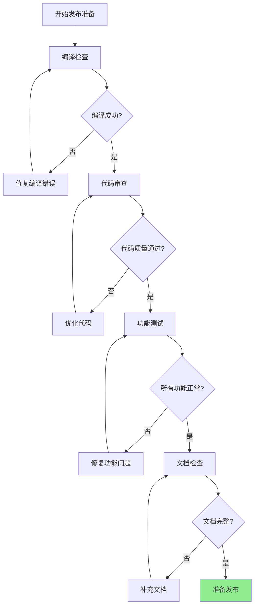
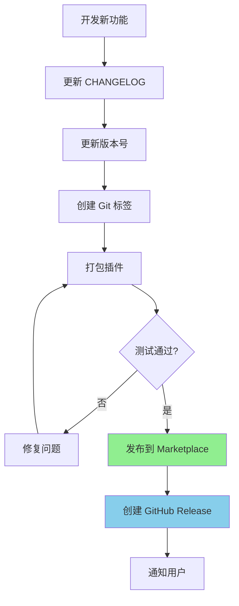
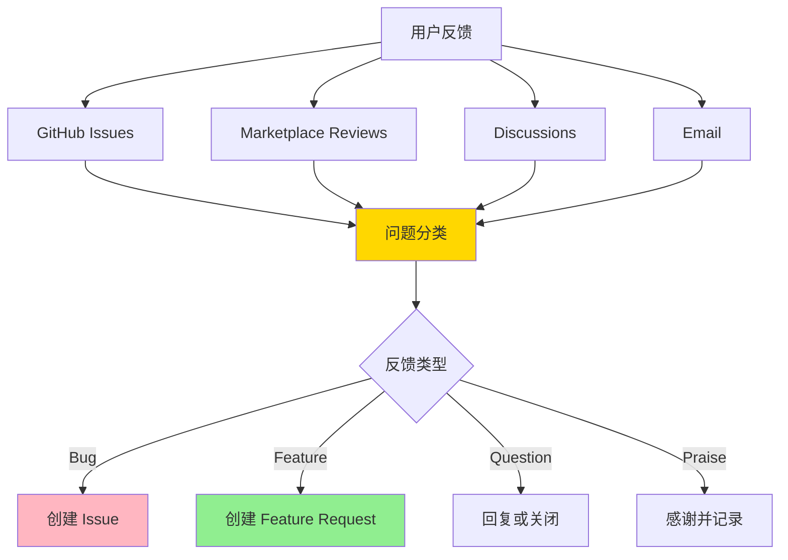
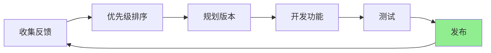
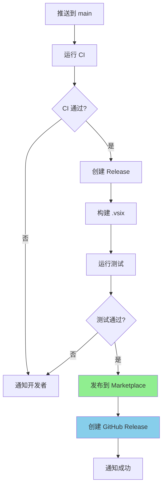

# VSCode 插件发布指南

本指南详细介绍如何将 VSCode 插件发布到 VSCode Marketplace，包括完整的发布流程、最佳实践和常见问题解决方案。

## 目录

1. [发布准备](#发布准备)
2. [账户与权限配置](#账户与权限配置)
3. [版本管理](#版本管理)
4. [发布流程](#发布流程)
5. [发布后维护](#发布后维护)
6. [自动化发布](#自动化发布)
7. [常见问题](#常见问题)
8. [最佳实践](#最佳实践)

---

## 发布准备

### 1. 代码质量检查



#### 编译检查

```bash
# 清理之前的编译输出
rm -rf out/

# 重新编译
npm run compile

# 检查是否有编译错误
if [ $? -ne 0 ]; then
    echo "编译失败，请修复错误后重试"
    exit 1
fi
```

#### 代码审查清单

- [ ] 所有 TypeScript 类型错误已修复
- [ ] 没有使用 `any` 类型（除非必要）
- [ ] 所有函数都有明确的返回类型
- [ ] 错误处理完善
- [ ] 没有未使用的变量和导入
- [ ] 代码格式符合项目规范
- [ ] 注释清晰准确

#### 功能测试清单

- [ ] 所有命令可以正常执行
- [ ] 快捷键工作正常
- [ ] Webview 面板正常显示
- [ ] 所有交互功能正常
- [ ] 配置项正确工作
- [ ] 主题适配正确（亮色/暗色主题）
- [ ] 响应式布局在不同尺寸下正常
- [ ] 性能表现良好（无明显卡顿）
- [ ] 内存无泄漏
- [ ] 控制台无错误和警告

### 2. 文档准备

#### 必需文档

**README.md**
```markdown
# 插件名称

简短描述（1-2句话）

## 功能特性
- 功能1
- 功能2

## 安装
...

## 使用
...

## 配置
...

## 常见问题
...
```

**CHANGELOG.md**
```markdown
# Changelog

## [1.0.0] - 2026-03-18

### Added
- 新功能1
- 新功能2

### Fixed
- 修复的问题1
- 修复的问题2

### Changed
- 变更的内容
```

**package.json 关键字段**
```json
{
  "name": "extension-id",
  "displayName": "Extension Name",
  "description": "清晰的描述",
  "version": "1.0.0",
  "publisher": "your-publisher-name",
  "repository": {
    "type": "git",
    "url": "https://github.com/username/repo"
  },
  "bugs": {
    "url": "https://github.com/username/repo/issues"
  },
  "license": "MIT",
  "icon": "resources/icon.png",
  "keywords": [
    "keyword1",
    "keyword2"
  ]
}
```

#### 推荐文档

- **CONTRIBUTING.md** - 贡献指南
- **LICENSE** - 开源许可证
- **PR_TEMPLATE.md** - Pull Request 模板
- **ISSUE_TEMPLATE/** - Issue 模板目录

### 3. 资源准备

#### 图标要求

```bash
resources/
├── icon.png          # 128x128 像素（必需）
├── icon.svg          # SVG 格式（可选，用于缩放）
└── preview.png       # 预览图（可选，推荐）
```

**图标设计规范**：
- 尺寸：128x128 像素（PNG）
- 格式：PNG 或 SVG
- 透明背景
- 清晰的视觉识别度
- 符合 VSCode 设计风格

**预览图规范**：
- 宽高比：16:9 或 4:3
- 分辨率：建议 1280x720 或 1920x1080
- 内容：展示插件主要功能
- 风格：简洁、专业

#### 截图准备

```bash
screenshots/
├── screenshot1.png  # 主界面
├── screenshot2.png  # 功能演示
└── screenshot3.png  # 配置界面
```

**截图要求**：
- 分辨率：1920x1080 或更高
- 格式：PNG
- 内容：清晰展示功能
- 主题：同时包含亮色和暗色主题

---

## 账户与权限配置

### 1. 创建 VSCode Marketplace 账户

#### 注册发布者

1. 访问 [VSCode Marketplace](https://marketplace.visualstudio.com/)
2. 点击右上角 "Sign in"
3. 使用 Microsoft、GitHub 或 Google 账户登录
4. 进入 [管理页面](https://marketplace.visualstudio.com/manage)
5. 创建发布者（Publisher）


#### 发布者信息配置

```json
{
  "name": "your-publisher-name",
  "displayName": "Your Publisher Display Name",
  "description": "关于发布者的描述",
  "website": "https://your-website.com",
  "privacyPolicyUrl": "https://your-website.com/privacy",
  "email": "your-email@example.com"
}
```

**注意事项**：
- 发布者名称一旦创建不可更改
- 只能使用小写字母、数字和连字符
- 名称必须全局唯一

### 2. 生成访问令牌（PAT）

#### 创建 Personal Access Token

1. 访问 [Token 管理页面](https://dev.azure.com/_usersSettings/tokens)
2. 点击 "Create New Token"
3. 配置令牌：
   ```
   Organization: All accessible organizations
   Scopes: Marketplace → Manage
   Expiration: 选择合适的过期时间
   ```
4. 复制生成的令牌（只显示一次）

#### 令牌安全最佳实践

```bash
# ❌ 不好的做法：直接写入代码
const token = "ghp_xxxxxxxxxxxxxxxxxxxx";

# ❌ 不好的做法：写入配置文件
# config.json
{
  "token": "ghp_xxxxxxxxxxxxxxxxxxxx"
}

# ✅ 好的做法：使用环境变量
const token = process.env.VSCE_PAT;

# ✅ 好的做法：使用配置文件（.gitignore）
# .env (添加到 .gitignore)
VSCE_PAT=ghp_xxxxxxxxxxxxxxxxxxxx
```

#### 配置环境变量

**Windows (PowerShell)**
```powershell
# 临时设置（当前会话）
$env:VSCE_PAT = "your-token-here"

# 永久设置
setx VSCE_PAT "your-token-here"
```

**macOS/Linux**
```bash
# 临时设置（当前会话）
export VSCE_PAT="your-token-here"

# 永久设置（添加到 ~/.bashrc 或 ~/.zshrc）
echo 'export VSCE_PAT="your-token-here"' >> ~/.bashrc
source ~/.bashrc
```

### 3. 安装发布工具

#### 安装 vsce

```bash
# 全局安装
npm install -g @vscode/vsce

# 验证安装
vsce --version
```

#### 配置 vsce

```bash
# 设置发布者
vsce create-publisher your-publisher-name

# 验证配置
vsce ls-publishers
```

---

## 版本管理

### 1. 语义化版本（Semantic Versioning）

版本号格式：`MAJOR.MINOR.PATCH`

- **MAJOR（主版本）**：不兼容的 API 变更
- **MINOR（次版本）**：向下兼容的功能新增
- **PATCH（修订版）**：向下兼容的问题修复

#### 版本示例

```
1.0.0  →  1.0.1  # 修复 bug
1.0.1  →  1.1.0  # 新增功能
1.1.0  →  2.0.0  # 重大变更
```

### 2. 版本发布流程



#### 更新版本号

```bash
# 使用 npm version 自动更新版本号
npm version patch   # 1.0.0 → 1.0.1
npm version minor   # 1.0.0 → 1.1.0
npm version major   # 1.0.0 → 2.0.0

# 手动更新版本号
# 编辑 package.json
{
  "version": "1.0.1"
}
```

#### 创建 Git 标签

```bash
# 添加所有更改
git add .

# 提交更改
git commit -m "chore: release v1.0.1"

# 创建标签
git tag -a v1.0.1 -m "Release v1.0.1"

# 推送标签到远程仓库
git push origin main --tags
```

### 3. 版本发布策略

#### 开发版本（Alpha/Beta）

```json
{
  "version": "1.1.0-alpha.1",
  "version": "1.1.0-beta.1",
  "version": "1.1.0-rc.1"
}
```

**预发布版本流程**：
1. 开发新功能
2. 发布 Alpha 版本（内部测试）
3. 发布 Beta 版本（公开测试）
4. 发布 RC 版本（候选发布）
5. 发布正式版本

#### 版本回滚

```bash
# 如果发现问题，需要回滚到之前的版本
git checkout v1.0.0

# 更新 package.json 版本号
npm version patch  # 1.0.0 → 1.0.1

# 发布修复版本
npm run publish
```

---

## 发布流程

### 1. 发布前检查

#### 使用 npm script 检查

```json
{
  "scripts": {
    "precheck": "npm run compile && npm run lint",
    "check": "vsce ls-publishers"
  }
}
```

```bash
# 运行检查
npm run precheck
npm run check
```

#### 使用自定义检查脚本

```bash
#!/bin/bash
# check-release.sh

echo "🔍 开始发布前检查..."

# 1. 检查编译
echo "📦 检查编译..."
npm run compile
if [ $? -ne 0 ]; then
    echo "❌ 编译失败"
    exit 1
fi

# 2. 检查版本
echo "📝 检查版本号..."
VERSION=$(node -p "require('./package.json').version")
echo "当前版本: $VERSION"

# 3. 检查 CHANGELOG
echo "📋 检查 CHANGELOG..."
if ! grep -q "## \[$VERSION\]" CHANGELOG.md; then
    echo "❌ CHANGELOG 中没有版本 $VERSION 的记录"
    exit 1
fi

# 4. 检查必需文件
echo "📄 检查必需文件..."
REQUIRED_FILES=("README.md" "LICENSE" "CHANGELOG.md" "package.json")
for file in "${REQUIRED_FILES[@]}"; do
    if [ ! -f "$file" ]; then
        echo "❌ 缺少文件: $file"
        exit 1
    fi
done

echo "✅ 所有检查通过"
```

### 2. 打包插件

#### 基本打包

```bash
# 打包为 .vsix 文件
npm run package

# 或使用 vsce
vsce package
```

#### 打包配置

**.vscodeignore** - 排除不需要打包的文件

```
# .vscodeignore
.vscode/**
.vscode-test/**
src/**
.gitignore
.yarnrc
vsc-extension-quickstart.md
**/tsconfig.json
**/.eslintrc.json
**/*.map
**/*.ts
node_modules/**
.git/**
.DS_Store
*.vsix
```

**.vscodeignore 规则**：
- `**/` 表示任意子目录
- `*` 表示任意文件名
- `!` 表示例外（不排除）

#### 自定义打包选项

```bash
# 指定输出文件名
vsce package --out my-extension-1.0.0.vsix

# 指定基础目录
vsce package --baseContentUrl https://example.com

# 跳过依赖检查
vsce package --skipDependencies
```

### 3. 本地测试

#### 安装测试

```bash
# 方法 1: 使用命令行
code --install-extension my-extension-1.0.0.vsix

# 方法 2: 在 VSCode 中
# 1. 按 Ctrl+Shift+P
# 2. 输入 "Extensions: Install from VSIX..."
# 3. 选择 .vsix 文件
```

#### 测试清单

```markdown
## 测试清单

### 基础功能
- [ ] 插件可以正常激活
- [ ] 所有命令可以执行
- [ ] 快捷键工作正常
- [ ] 配置项可以修改

### UI 功能
- [ ] Webview 面板正常显示
- [ ] 所有交互功能正常
- [ ] 响应式布局正常
- [ ] 主题适配正确

### 性能
- [ ] 启动速度正常
- [ ] 无明显卡顿
- [ ] 内存使用合理
- [ ] 无内存泄漏

### 兼容性
- [ ] 不同操作系统测试
- [ ] 不同 VSCode 版本测试
- [ ] 不同主题测试
```

### 4. 发布到 Marketplace

#### 使用 vsce 发布

```bash
# 方法 1: 使用环境变量
export VSCE_PAT="your-token-here"
vsce publish

# 方法 2: 使用配置文件
# 创建 ~/.vsce
{
  "pat": "your-token-here"
}

# 方法 3: 交互式输入
vsce publish
# 会提示输入 PAT
```

#### 发布选项

```bash
# 发布特定版本
vsce publish 1.0.0

# 发布预发布版本
vsce publish --pre-release

# 指定发布者
vsce publish --publisher your-publisher-name

# 指定包文件
vsce publish --package my-extension-1.0.0.vsix
```

#### 发布流程图

```mermaid
sequenceDiagram
    participant Dev as 开发者
    participant CLI as vsce CLI
    participant API as Marketplace API
    participant User as 用户

    Dev->>CLI: vsce publish
    CLI->>CLI: 验证 package.json
    CLI->>CLI: 打包插件
    CLI->>API: 上传 .vsix 文件
    API->>API: 验证插件
    API->>API: 处理插件
    API-->>CLI: 发布成功
    CLI-->>Dev: 确认消息
    User->>API: 下载插件
    API-->>User: 插件安装包

    style API fill:#87CEEB
    style CLI fill:#FFD700
```

### 5. 验证发布

#### 验证步骤

1. **检查 Marketplace 页面**
   - 访问插件页面
   - 确认版本号
   - 检查描述和截图

2. **测试安装**
   ```bash
   # 在新的 VSCode 实例中测试
   code --install-extension your-extension-name
   ```

3. **检查插件列表**
   - 在 VSCode 扩展面板中搜索
   - 确认插件可以找到

4. **查看发布日志**
   ```bash
   # 查看发布历史
   vsce show your-publisher-name.your-extension-name
   ```

### 6. 创建 GitHub Release

#### 自动创建 Release

```bash
# 使用 GitHub CLI
gh release create v1.0.0 \
  --title "Release v1.0.0" \
  --notes "Release notes here" \
  --assets my-extension-1.0.0.vsix
```

#### 手动创建 Release

1. 访问 GitHub 仓库
2. 点击 "Releases"
3. 点击 "Draft a new release"
4. 选择标签（Tag）
5. 填写标题和描述
6. 上传 .vsix 文件
7. 点击 "Publish release"

#### Release 模板

```markdown
## Release v1.0.0

### 🎉 New Features
- 新功能1
- 新功能2

### 🐛 Bug Fixes
- 修复的问题1
- 修复的问题2

### 📝 Documentation
- 更新文档

### 📦 Installation

```bash
code --install-extension your-extension-name
```

Or install from [VS Code Marketplace](https://marketplace.visualstudio.com/items?itemName=your-publisher-name.your-extension-name)

### 📄 Change Log

See [CHANGELOG.md](CHANGELOG.md) for full details.
```

---

## 发布后维护

### 1. 监控反馈

#### 监控渠道



#### 设置通知

```bash
# GitHub 通知设置
# 1. 访问仓库 Settings
# 2. 配置 Notifications
# 3. 设置邮件通知

# VSCode Marketplace 通知
# 1. 访问 Marketplace 管理页面
# 2. 配置通知设置
```

### 2. 问题管理

#### Issue 分类模板

```markdown
## Bug Report

### Description
简要描述问题

### Steps to Reproduce
1. 步骤1
2. 步骤2

### Expected Behavior
期望的行为

### Actual Behavior
实际的行为

### Environment
- OS: [e.g. Windows 10]
- VS Code Version: [e.g. 1.74.0]
- Extension Version: [e.g. 1.0.0]

### Screenshots
如果相关，添加截图
```

#### 响应时间目标

- **Bug 报告**：24-48 小时内响应
- **功能请求**：1 周内响应
- **问题**：48 小时内响应

### 3. 版本更新

#### 定期更新策略



#### 版本更新频率

- **补丁版本**：根据 bug 严重程度
- **次版本**：每 2-4 周一次
- **主版本**：每 3-6 个月一次

### 4. 文档维护

#### 文档更新清单

```markdown
## 文档更新检查清单

### 每次发布后
- [ ] 更新 CHANGELOG.md
- [ ] 更新 README.md（如有新功能）
- [ ] 更新截图（如有 UI 变更）
- [ ] 更新配置说明（如有新配置）

### 定期维护
- [ ] 检查文档准确性
- [ ] 更新示例代码
- [ ] 添加常见问题
- [ ] 更新最佳实践
```

---

## 自动化发布

### 1. GitHub Actions CI/CD

#### 自动化发布流程



#### GitHub Actions 配置

创建 `.github/workflows/release.yml`:

```yaml
name: Release Extension

on:
  push:
    tags:
      - 'v*'

jobs:
  release:
    runs-on: ubuntu-latest

    steps:
      - name: Checkout code
        uses: actions/checkout@v3

      - name: Setup Node.js
        uses: actions/setup-node@v3
        with:
          node-version: '18'
          cache: 'npm'

      - name: Install dependencies
        run: npm ci

      - name: Compile TypeScript
        run: npm run compile

      - name: Run tests
        run: npm test

      - name: Package extension
        run: npm run package

      - name: Create Release
        uses: softprops/action-gh-release@v1
        with:
          files: |
            *.vsix
          draft: false
          prerelease: false
        env:
          GITHUB_TOKEN: ${{ secrets.GITHUB_TOKEN }}

      - name: Publish to Marketplace
        run: vsce publish -p ${{ secrets.VSCE_PAT }}
```

### 2. 版本自动化

#### 自动更新版本号

```json
{
  "scripts": {
    "version": "node -e \"require('child_process').exec('git tag -a v' + require('./package.json').version + ' -m \"Release v' + require('./package.json').version + '\"')\""
  }
}
```

#### 自动生成 CHANGELOG

使用 `standard-version` 或 `semantic-release`:

```bash
# 安装
npm install -D standard-version

# 配置 package.json
{
  "scripts": {
    "release": "standard-version && git push --follow-tags origin main"
  }
}

# 使用
npm run release
```

### 3. 自动化测试

#### 测试配置

```json
{
  "scripts": {
    "test": "mocha 'out/test/**/*.test.js'",
    "test:watch": "mocha --watch 'out/test/**/*.test.js'",
    "test:coverage": "nyc mocha 'out/test/**/*.test.js'"
  }
}
```

#### GitHub Actions 测试

```yaml
name: Test

on: [push, pull_request]

jobs:
  test:
    runs-on: ubuntu-latest

    strategy:
      matrix:
        node-version: [16.x, 18.x, 20.x]

    steps:
      - uses: actions/checkout@v3
      - name: Use Node.js ${{ matrix.node-version }}
        uses: actions/setup-node@v3
        with:
          node-version: ${{ matrix.node-version }}
          cache: 'npm'
      - run: npm ci
      - run: npm run compile
      - run: npm test
```

---

## 常见问题

### 1. 发布错误

#### 错误：Publisher Not Found

```
Error: Publisher 'your-name' not found
```

**解决方案**：
1. 访问 [Marketplace 管理页面](https://marketplace.visualstudio.com/manage)
2. 创建发布者
3. 更新 package.json 中的 publisher 字段

#### 错误：Authentication Failed

```
Error: Invalid Personal Access Token
```

**解决方案**：
1. 访问 [Token 管理页面](https://dev.azure.com/_usersSettings/tokens)
2. 生成新的 PAT
3. 确保选择 "Marketplace → Manage" 权限
4. 重新设置环境变量

#### 错误：Package Size Too Large

```
Error: Extension size exceeds 100MB
```

**解决方案**：
1. 检查 .vscodeignore 配置
2. 排除不必要的文件
3. 压缩图片资源
4. 清理 node_modules

```bash
# 检查包大小
vsce ls

# 查看打包内容
vsce package --out package.zip
unzip -l package.zip
```

### 2. 审核问题

#### 审核被拒绝

**常见原因**：
- 违反 Marketplace 政策
- 插件名称已被使用
- 描述不够清晰
- 缺少必要的截图

**解决方案**：
1. 仔细阅读 [Marketplace 政策](https://code.visualstudio.com/api/references/extension-guidelines)
2. 修改违规内容
3. 提供详细的描述和截图
4. 重新提交审核

### 3. 兼容性问题

#### VSCode 版本兼容性

```json
{
  "engines": {
    "vscode": "^1.74.0"
  }
}
```

**最佳实践**：
- 测试多个 VSCode 版本
- 使用稳定的 API
- 避免使用实验性 API

#### 操作系统兼容性

```bash
# 在不同操作系统上测试
# Windows
code --install-extension my-extension.vsix

# macOS
code --install-extension my-extension.vsix

# Linux
code --install-extension my-extension.vsix
```

### 4. 性能问题

#### 启动缓慢

**解决方案**：
1. 延迟加载
2. 减少激活事件
3. 优化初始化代码

```typescript
// 延迟加载示例
vscode.commands.registerCommand('myExt.show', () => {
    // 只在需要时加载模块
    const panel = new Panel();
    panel.show();
});
```

---

## 最佳实践

### 1. 发布流程最佳实践

#### 版本控制

```bash
# 使用 Git 分支管理
main        # 稳定版本
develop     # 开发版本
feature/*   # 功能分支
hotfix/*    # 紧急修复
```

#### 发布检查清单

```markdown
## 发布前检查清单

### 代码质量
- [ ] 所有测试通过
- [ ] 代码审查完成
- [ ] 无编译错误
- [ ] 无控制台警告

### 文档
- [ ] README.md 更新
- [ ] CHANGELOG.md 更新
- [ ] 截图更新

### 测试
- [ ] 功能测试完成
- [ ] 兼容性测试完成
- [ ] 性能测试完成

### 发布
- [ ] 版本号更新
- [ ] Git 标签创建
- [ ] .vsix 文件生成
- [ ] 发布到 Marketplace
- [ ] GitHub Release 创建
```

### 2. 版本管理最佳实践

#### 语义化版本

```
1.0.0  →  初始稳定版本
1.0.1  →  Bug 修复
1.1.0  →  新增功能（向后兼容）
2.0.0  →  重大变更（不向后兼容）
```

#### 预发布版本

```
1.1.0-alpha.1  →  Alpha 版本（内部测试）
1.1.0-beta.1   →  Beta 版本（公开测试）
1.1.0-rc.1     →  候选发布版本
1.1.0          →  正式版本
```

### 3. 安全最佳实践

#### 保护访问令牌

```bash
# ❌ 不要提交到版本控制
# .env
VSCE_PAT=ghp_xxx

# ✅ 使用 GitHub Secrets
# GitHub Actions 中使用
env:
  VSCE_PAT: ${{ secrets.VSCE_PAT }}
```

#### 代码签名

```bash
# 使用 vsce 签名
vsce publish --sign
```

### 4. 用户体验最佳实践

#### 清晰的描述

```json
{
  "description": "简洁、清晰的描述（最多 100 字符）",
  "longDescription": "详细描述（可以使用 Markdown）"
}
```

#### 优质的截图

```bash
# 截图要求
- 高分辨率（1920x1080）
- 清晰展示功能
- 包含亮色和暗色主题
- 添加文字说明
```

#### 完善的文档

```markdown
# README.md 结构

1. 简短描述
2. 功能特性
3. 安装说明
4. 使用教程
5. 配置选项
6. 常见问题
7. 贡献指南
8. 许可证
```

### 5. 监控和维护最佳实践

#### 设置监控

```javascript
// 使用遥测（Telemetry）
const telemetry = vscode.extensions.getExtension('publisher.extension');
telemetry.exports.sendTelemetryEvent('event_name', {
    data: 'value'
});
```

#### 定期更新

```
- 每月检查一次依赖更新
- 每季度发布一次功能更新
- 根据需要发布补丁更新
```

---

## 资源链接

### 官方文档

- [VSCode Extension API](https://code.visualstudio.com/api)
- [Publishing Extensions](https://code.visualstudio.com/api/working-with-extensions/publishing-extension)
- [vsce Documentation](https://github.com/microsoft/vscode-vsce)
- [Marketplace Guidelines](https://code.visualstudio.com/api/references/extension-guidelines)

### 工具和资源

- [Semantic Versioning](https://semver.org/)
- [Conventional Commits](https://www.conventionalcommits.org/)
- [Keep a Changelog](https://keepachangelog.com/)
- [GitHub Actions](https://docs.github.com/en/actions)

### 社区支持

- [VSCode Extension API GitHub](https://github.com/microsoft/vscode-extension-samples)
- [VSCode Community Discord](https://aka.ms/vscode-discord)
- [Stack Overflow](https://stackoverflow.com/questions/tagged/vscode-extension)

---

## 总结

发布 VSCode 插件需要仔细的准备和测试，遵循最佳实践可以确保发布过程顺利，为用户提供优质的使用体验。

### 关键要点

1. ✅ 详细的发布前检查
2. ✅ 正确的版本管理
3. ✅ 完善的文档和资源
4. ✅ 严格的测试流程
5. ✅ 有效的反馈监控
6. ✅ 定期的维护更新

### 下一步

- 阅读 [VSCode Extension API 文档](https://code.visualstudio.com/api)
- 参考优秀的插件示例
- 加入 VSCode 扩展开发者社区

祝你发布顺利！🚀